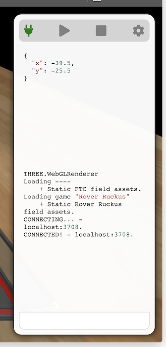

# **Introduction**

Birdseye Viewer is a utility targeted to participants in the FIRST Tech Challenge robotics competition. Its aim to to ease some of the inefficiencies and tediousness that arises while developing the robot - particularly the autonomous programs.

The foremost function of Birdseye Viewer is to provide the user with a 3D rendering of their robots position on the FTC field in real time. Those data can be generated however you like, but we also provide Birdseye Server and Birdseye Tracker which can do it all for you.


# **JSON Data Reference**

Below is a quick reference for the JSON data the Birdseye Viewer consumes. For basic functionality, only keys *x* and *y* are strictly necessary. These represent the position of the robot on the field. Optionally, *z* can also be provided to raise the robot off the field. *Pitch, Roll*, and *Heading* are also correctly reflected in the rendering. However, none of these inputs are required.

## *Robot Position*

The robots position as rendered in BirdseyeViewer is determined by an object with the `robot` in the telemetry payload. The object may contain all or some of the fields described below. 

|Key|Type|Range|Description|
|---|---|---|---|
|x|number|-144,144|The X position of the robot relative to the field's coordinate plane.
|y|number|-144,144|The Y position of the robot relative to the field's coordinate plane.
|z|number|0,Infinity|The Z position of the robot relative to the field's coordinate plane.
|pitch|number|-180,180|The rotation of the robot around the X axis of its own coordinate plane.
|roll|number|-180,180|The rotation of the robot around the Y axis of its own coordinate plane.
|heading|number|-180,180|The rotation of the robot around the Z axis relative to the field's coordinate plane. 

_Example_

Render the robot on the field at `[34.2, 55.1, 0.5]` with a pitch and roll of `0` degrees and a heading of `153` degrees.
```json
{
    robot: {
        x: 34.2,
        y: 55.1,
        z: 0.5
        pitch: 0,
        roll: 0,
        heading: 153
    }
}
```

## *Target Indicators*

Target indicators are a useful feature for debugging on-bot logic that computes a target point. The top-level key `targets` in the telemetry payload should be an array of objects. Each object should consist of the fields described below. A visible target pin, much like a pin in Google Maps, will be drawn at the coordinates described in each element of the array.

|Key|Type|Range|Description|
|---|---|---|---|
|relativeTo|string|'robot', 'field'|The object (either the robot or the field) relative to which the target indicator should be plotted. If omitted, the indicator will be drawn in the field's coordinate plane. 
|x|number|-144,144|The X position of the target indicator.
|y|number|-144,144|The Y position of the target indicator.
|z|number|0,Infinity|The Z position of the target indicator.
|color|[hex triplet](https://en.wikipedia.org/wiki/Web_colors#Hex_triplet)| |The optional color to use to help identify this target indicator.

_Example_

Draw three target indicators. One at `[40, 60, 0]` relative to the robot, another at `[40, 60, 0]` relative to the field, and a third and final one at `[-40, -10, 5]` relative to the field and rendered in red.
```json
{
    targets: [
        { relativeTo: "robot", x: 40, y: 60 },
        { x: 40, y: 60, z: 0 },
        { x: -40, y: -10, z: 5, color: "#FF0000" },
    ]
}
```


# **Extensibility**
One of the great things about the structure of Birdseye is that really, you can send to it any data you wish. If you would like to transmit more verbose diagnostic detail, you can throw it all into the data you send to Birdseye Viewer. Further, because Birdseye is open-source, it can be extended to actually respond to that data however you like using JavaScript. Unrecognized keys will simply be displayed on screen in a cleanly formatted JSON view.



